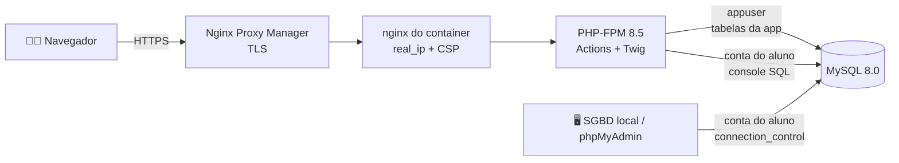

<div align="center">

# 🧪 DB Lab Estudantes

**Laboratório de banco de dados para turmas: cada aluno ganha uma conta MySQL de verdade,
cria os próprios schemas e pratica SQL no navegador, no phpMyAdmin ou no SGBD favorito.**

[](https://github.com/huriellopes/db-lab-estudantes/actions/workflows/ci.yml)


[🚀 Começar](#-comece-em-3-passos) ·
[🔐 Segurança](#-segurança-em-destaque) ·
[👥 Papéis](#-papéis) ·
[🏗️ Arquitetura](#️-arquitetura) ·
[☁️ Produção](#️-produção-contabo) ·
[🧪 Testes](#-testes)

</div>

---

## ✨ O que tem aqui

| | |
|---|---|
| 🗄️ **Conta MySQL real por pessoa** | O username escolhido no cadastro vira login MySQL, usado na app, no phpMyAdmin e em qualquer SGBD local. |
| 🧱 **Schemas isolados** | Cada um cria os próprios databases (`<prefixo>__nome`) e **só enxerga os seus**. Quem garante é o `GRANT` do MySQL, não a app. |
| 💻 **Console SQL no navegador** | Roda scripts com vários comandos usando a conta da própria pessoa, com consultas salvas e limites de tempo e memória. |
| 🧩 **Laboratório de modelagem ER** | Diagramas arrastáveis, salvos por usuário. |
| 📚 **Guia de estudos** | SQL ANSI, MySQL, PostgreSQL, SQL Server, Oracle, MongoDB, Redis, formas normais, modelagem ER. |
| 👩‍🏫 **Gestão de turma** | Professores administram alunos; o admin administra tudo, inclusive a lixeira com restauração. |
| 🐳 **Mesma imagem em dev e produção** | `php:8.5-fpm` + nginx + supervisord, com migrations automáticas no boot. |



## 🚀 Comece em 3 passos

```bash
cp .env.example .env                                   # 1. ajuste as senhas e gere o APP_KEY (ver comentário no arquivo)
docker compose up -d --build                           # 2. sobe MySQL + phpMyAdmin + app (migrations rodam sozinhas)
docker compose exec app php bin/console.php user:promote-admin voce@exemplo.com   # 3. depois de se cadastrar em /register
```

| Serviço | URL |
|---|---|
| 🌐 Aplicação | http://localhost:8080 |
| 🐬 phpMyAdmin | http://localhost:8081 |
| 🔌 MySQL | `localhost:3307` (com a conta de aluno; ver o aviso abaixo) |

> [!TIP]
> O passo 3 mostra os dados da conta e pede pra você **digitar o username dela** antes de
> promover. O cadastro não verifica e-mail: se o username mostrado não for o seu, alguém se
> cadastrou com o seu e-mail antes. **Não confirme** nesse caso.

> [!NOTE]
> Em instalação nova, o **root do MySQL só aceita conexão de dentro do container**
> (`MYSQL_ROOT_HOST=localhost`). Para mexer como root: `docker compose exec mysql mysql -uroot -p`.
> De fora, conecte com uma conta de aluno ou com o `appuser`.

## 🔐 Segurança em destaque

O projeto passou por uma varredura completa em **2026-10-07**. O registro de cada decisão,
de cada achado e do que ainda está pendente fica no **[SECURITY.md](SECURITY.md)**.

| Camada | Proteção |
|---|---|
| 🧱 Isolamento entre alunos | `GRANT` por prefixo de schema **fixo por conta**. Trocar o login não libera o prefixo antigo pra mais ninguém. |
| 💉 SQL injection | DML 100% com prepared statements. DDL (que não aceita bind) só com identificadores validados por allow-list. |
| 🔑 Senhas | bcrypt, mínimo de 10 caracteres, lista de senhas comuns, não pode conter o username nem o e-mail. |
| 🚦 Força bruta | Rate limit por IP real e por conta na app; no MySQL público, o plugin `connection_control` atrasa as tentativas (até 30s). |
| 🍪 Sessão | Revalidada a cada request (conta desativada, papel alterado ou senha trocada derrubam na hora). 2h de inatividade e 12h no máximo. `use_strict_mode`, cookies `HttpOnly`/`SameSite`. |
| 🛡️ Web | CSRF em todo POST, Twig com autoescape, CSP, `X-Frame-Options`, `nosniff`, erros sem detalhe interno. |
| 🐬 MySQL | `appuser` sem privilégios administrativos, root só local, até 10 conexões por conta, console com teto de tempo, linhas e execuções. |
| 📦 Cadeia de suprimentos | Imagens e actions com versão fixa (actions por SHA), `composer audit` + `npm audit` no CI, Dependabot. |

> [!WARNING]
> **O MySQL de produção é público de propósito** (conexão direta por SGBD local, sem túnel
> SSH). As proteções acima existem por causa disso, mas a senha de cada conta continua sendo
> a principal defesa. Reforce isso com a turma.

## 👥 Papéis

| Papel | Pode |
|---|---|
| 🎓 **Aluno** | Cadastrar-se (só alunos se autocadastram), logar com e-mail **ou** username, criar/excluir os próprios schemas, editar o próprio perfil (nome/senha/username). |
| 👩‍🏫 **Professor** | Tudo do aluno, **+** ver, editar, ativar/desativar, resetar senha e excluir (soft delete) contas de aluno (`/professor/alunos`). |
| 🛡️ **Admin** (super admin) | Tudo do professor, **+** criar usuários de qualquer papel, gerenciar qualquer usuário não-admin (ativar/desativar, excluir, restaurar da lixeira), promover/rebaixar papéis, e ver/excluir **qualquer** schema do sistema (`/admin`). Promovido via `php bin/console.php user:promote-admin <email>`. Não aparece em `/admin/usuarios` (contas admin não entram nessa lista). |

## ⚙️ Como funciona

- No cadastro, a pessoa escolhe seu **username**. Ele vira o login MySQL/phpMyAdmin *e* uma
  forma alternativa de entrar na própria app (o login aceita e-mail **ou** username).
- **Esqueceu a senha?** `/esqueci-senha` manda um link por e-mail (válido por 1h, uso único)
  pra escolher uma senha nova, sem depender de admin ou professor. Precisa de SMTP
  configurado (`MAIL_HOST` etc. no `.env`); sem isso a app não quebra, só não envia o e-mail
  (ver `App\Core\Mailer`). Trocar a senha por qualquer caminho **derruba as outras sessões**
  e os "manter conectado" de todos os dispositivos.
- No painel (`/dashboard`), a pessoa cria schemas `<prefixo>__nome`: a app executa
  `CREATE DATABASE` e concede `GRANT ALL PRIVILEGES` **só** naquele schema, pra conta MySQL
  da pessoa. Pelo console SQL também dá pra rodar `CREATE DATABASE <prefixo>__algo;` direto.
- Em "Meu perfil" dá pra trocar o nome, a senha (app e MySQL juntos) e o username/login do
  phpMyAdmin (`RENAME USER` de verdade). O **prefixo dos schemas não muda** no rename: os
  schemas novos continuam com o prefixo da criação da conta, e o login antigo fica reservado.
- **Ativar/desativar** (professor sobre alunos, admin sobre todo mundo) bloqueia o login na
  app *e* o acesso MySQL/phpMyAdmin (`ALTER USER ... ACCOUNT LOCK`) sem apagar nada. É
  reversível a qualquer momento, e quem estava logado sai na hora.
- **Excluir é soft delete**, como o `SoftDeletes` do Laravel: marca `deleted_at` e bloqueia o
  acesso MySQL, mas **não apaga** a linha, os databases nem a conta MySQL da pessoa. O admin
  vê e restaura contas excluídas em `/admin/usuarios/lixeira`.

## 🗃️ Migrations, seeders e factories (estilo Laravel)

```bash
composer migrate            # roda as migrations pendentes (também roda sozinho ao subir o container)
composer migrate:status      # lista o que já rodou
composer migrate:rollback     # desfaz o último lote
composer db:seed               # roda database/seeders/DatabaseSeeder (hoje sem seeders padrão)
php bin/console.php user:promote-admin <email>   # promove uma conta existente a admin (pede confirmação)
```

- `database/migrations/*.php`: cada arquivo devolve uma classe anônima `extends
  App\Core\Migration` com `up()`/`down()`, igual ao estilo de migration do Laravel 8+.
  `App\Core\Migrator` roda as pendentes e registra numa tabela `migrations` (com `batch`,
  pra dar pra reverter o último lote).
- `database/seeders/`: `DatabaseSeeder` é o ponto de entrada; hoje sem seeders padrão.
- `database/factories/UserFactory.php`: no estilo das factories do Laravel, com
  [`fakerphp/faker`](https://fakerphp.org/) (`require-dev`, só disponível localmente, não
  na imagem de produção).

## 🏗️ Arquitetura

```
composer.json            # autoload PSR-4 (App\, Database\Seeders\, Database\Factories\)
package.json              # Vite, Tailwind v4, Alpine.js, Axios, Prettier
vite.config.js
Dockerfile                # multi-stage: composer -> npm/vite -> php:8.5-fpm + nginx + supervisord
docker-compose.yml           # dev — MESMA imagem/Dockerfile da produção (paridade de ambiente)
docker-compose.prod.yml       # produção (Contabo) — sem porta pública na app, rede própria
docker/
  nginx.conf                    # site do nginx (fastcgi -> php-fpm)
  supervisord.conf                # gerencia nginx + php-fpm dentro do container
  php-hardening.ini                # display_errors/expose_php Off, log_errors On (stderr)
  app-entrypoint.sh                 # roda `migrate` e sobe o supervisord
  deploy.sh                          # roda NO SERVIDOR — git pull + docker compose up --build
.github/workflows/
  ci.yml                    # testes, padrão de código, build (toda branch/PR pra dev e main)
  deploy.yml                 # SSH no Contabo + deploy.sh (só depois do CI passar na main)
.github/dependabot.yml       # PRs automáticos de atualização (composer, npm, imagens, actions)
bin/console.php             # CLI (migrate, migrate:rollback, migrate:status, db:seed, user:promote-admin)
phpunit.xml, tests/          # Pest
.php-cs-fixer.php             # padrão de código PHP (PSR-12 + regras extra)
.prettierrc.json                # padrão de código JS/CSS
.editorconfig
SECURITY.md                       # decisões de segurança, achados corrigidos e pendências

database/
  migrations/    # classes anônimas com up()/down() — fonte da verdade do schema
  seeders/        # DatabaseSeeder
  factories/       # UserFactory (Faker)

app/
  Actions/         # "Single Action" (ver App\Core\Action, __invoke() só) — TODA rota da app
                    é uma Action hoje: Auth, PasswordReset, Dashboard, Schema, Profile,
                    Connection, SqlConsole, SavedQuery, ErDiagram, Guide, Student (professor),
                    Admin. Uma classe por operação; quando várias ações do mesmo recurso
                    genuinamente compartilham lógica (ex.: achar o usuário-alvo validando
                    permissão), essa lógica compartilhada vira uma base abstrata só daquele
                    grupo (App\Actions\Student\StudentAction, App\Actions\Admin\AdminUserAction)
                    — nunca duplicada entre as Actions concretas.
  Controllers/    # Vazia hoje (fica pra quando um recurso novo genuinamente precisar de um
                    Controller multi-ação em vez de várias Actions — ver App\Core\Router,
                    que aceita os dois formatos)
  Core/            # Router (com {id} dinâmico, aceita Controller multi-ação OU Action única),
                    Controller (render/redirect/respond/json/genericError), Action (base de
                    Single Action, estende Controller), View (Twig), Vite, Database (PDO,
                    incl. connectAs() pro console SQL), Mailer (PHPMailer/SMTP),
                    Migration/Migrator/Console, Seeder, Auth (sessão + papéis + senha MySQL
                    cacheada), Flash, Config
  Support/         # Lógica pura, sem I/O — o que os testes do Pest cobrem:
                    Role (enum), AuthenticatedUser (com shortName()), AdminStats, GuideTopics,
                    ErDiagramValidator, FlashType/FlashMessage, MysqlIdentifier,
                    RegistrationValidator, SchemaNameBuilder, Policy, TableQuery/Paginator/
                    TableFilter (busca/ordenação/paginação das listagens), Crypto (libsodium,
                    senha MySQL em cache de sessão), SqlScriptSplitter (console SQL), Csrf,
                    RateLimitDecision, ClientIp, RequestScheme, PasswordPolicy, SessionTimeout,
                    CappedResult (teto de linhas do console SQL)
  Models/
    Entities/          # DTOs readonly tipados: User, Schema, SchemaWithOwner, StudentSummary
    User.php, SchemaRecord.php  # acesso às tabelas da própria app, devolvem as Entities
  Services/        # SchemaProvisioner (DDL no MySQL, incl. ACCOUNT LOCK/UNLOCK), UserManager
                    (provisionNewUser/resetPassword/rename/setActive/softDelete/restore)
  Views/           # .twig — SEM PHP misturado, só a sintaxe do Twig
    layouts/ (app, guest), auth/, dashboard/, profile/, connection/, professor/students/,
    admin/, partials/, macros/ (forms.twig, table_controls.twig), errors/

public/
  index.php        # front controller — todas as rotas passam por aqui
  .htaccess
  build/            # gerado pelo `npm run build` (Vite) — não editar

resources/
  css/app.css       # fonte do Tailwind v4 (@import "tailwindcss"; + @utility/@layer)
  js/app.js          # Alpine.js + Axios (toaster, modal de confirmação, `ajaxForm`)

mysql/init/          # só o bootstrap de privilégios do appuser (o schema em si vem das migrations)
```

### MVC altamente tipado

- `declare(strict_types=1)` em **todo** arquivo PHP da aplicação.
- `App\Support\Role`: enum tipado (`Aluno`/`Professor`/`Admin`) no lugar de strings soltas.
  PHP não deixa enum implementar `__toString()`, então exibir usa `->label()`/`->value`.
- Nenhum Model devolve array cru do PDO: `User`/`SchemaRecord` sempre devolvem DTOs
  `readonly` tipados (`App\Models\Entities\*`), construídos via `fromRow()`.
- A sessão guarda um `App\Support\AuthenticatedUser` `readonly` de verdade (não array) —
  de propósito sem `password_hash`, pra esse hash nem chegar a ficar no arquivo de sessão.
  A sessão também cacheia, separadamente, a senha MySQL em texto puro (pro console SQL abrir
  conexão como a própria pessoa) — mas sempre criptografada com `App\Support\Crypto`, nunca
  em claro (ver seção "Console SQL").
- **Single Action** (`App\Core\Action`, `app/Actions/`): rota que aponta pra uma classe só,
  chamada via `__invoke()` — sem método pra escolher. `App\Core\Router::dispatch()` aceita
  tanto isso quanto o formato "clássico" `[Controller::class, 'metodo']` (`app/Controllers/`
  continua existindo, vazia, pra quando um recurso genuinamente precisar de um Controller
  multi-ação de novo), mas hoje toda rota da app é uma Action. Quando várias Actions do
  mesmo recurso compartilham lógica de verdade (ex.: achar o usuário-alvo validando
  permissão em `/admin/usuarios/{id}/...`), essa lógica vira uma base abstrata só daquele
  grupo — `App\Actions\Admin\AdminUserAction`/`App\Actions\Student\StudentAction` — em vez
  de duplicada em cada Action concreta ou de forçar de volta um Controller multi-ação.
- Mensagens flash são `FlashType` (enum) + `FlashMessage` (DTO), não strings soltas tipo `'success'`.
- `App\Core\Router` roteia com o tipo nativo `array{0: class-string<Controller>, 1: string}|class-string<Action>` (union real, não só PHPDoc).

### Mecanismo de renderização (sem PHP misturado com HTML)

`App\Core\View` encapsula o Twig: os controllers só chamam `$this->render('pasta/view', [...])`
e passam dados (as Entities tipadas acima); o template (`.twig`) só usa a sintaxe do Twig
(`{{ }}`, ``) — nunca `<?php ?>`. Herança de layout é feita com ``/
`` dentro do próprio template. Funções expostas: `auth_user()`, `is_admin()`,
`is_professor()`, `can_manage_students()`, `flash()`, `vite()` (tags de asset, resolvidas
via manifest do Vite em produção ou via `VITE_DEV_SERVER_URL` em desenvolvimento). Cache de
templates compilados com `auto_reload` sempre ligado, pra nunca servir uma versão antiga.

### Ações via Alpine.js + Axios

Botões de excluir/editar/trocar-papel/ativar-desativar usam um componente Alpine genérico
(`ajaxForm`, em `resources/js/app.js`) que envia o `<form>` via Axios com o header
`X-Requested-With`. O controller (`Controller::respond()`) detecta esse header e responde
com **JSON** (a linha some da tela sem recarregar a página); sem esse header — ou se o JS
não carregar — o mesmo endpoint responde do jeito clássico (redirect + flash), então tudo
funciona sem JavaScript também (progressive enhancement).

### Roteamento

`App\Core\Router` é um router simples próprio, sem framework, com suporte a segmentos
dinâmicos (`/professor/alunos/{id}/editar`) via regex.

### Toaster, modal de confirmação, navbar e responsividade

- **Toaster**: `Alpine.store('toasts')` (em `resources/js/app.js`), desenhado uma vez em
  `partials/toaster.twig` (incluído nos dois layouts). Flash do servidor (`partials/flash.twig`)
  vira um toast automaticamente no load da página via `x-init`; respostas Ajax (sucesso ou
  erro) também empurram pra lá — nunca mais um `alert()` nativo.
- **Modal de confirmação**: `Alpine.store('confirmModal')` + `window.confirmAction({title,
  message, confirmLabel, danger})` (retorna uma Promise), desenhado uma vez em
  `partials/confirm-modal.twig`. Toda ação destrutiva ou de impacto sobre outra pessoa —
  excluir schema/aluno/usuário, resetar senha, trocar papel, ativar/desativar, restaurar,
  renomear o username — passa por ele antes de enviar o form (via `ajaxForm`). Saves
  triviais do próprio usuário (nome, senha) não pedem confirmação extra.
- **Navbar**: o dropdown de conta mostra só primeiro+último nome
  (`AuthenticatedUser::shortName()`, testado) — evita quebra de linha no botão. Links de
  Administração/Usuários/Schemas ficam agrupados num dropdown "Admin" (`partials/nav-links.twig`,
  reaproveitado entre desktop e o menu hamburguer mobile, que mostra os mesmos links em
  lista plana em vez de dropdown aninhado).
- **Responsivo**: grids viram coluna única, tabelas ganham scroll horizontal
  (`overflow-x-auto`), linhas de listas empilham (`flex-col sm:flex-row`) abaixo do
  breakpoint `sm`/`md` do Tailwind, em todas as páginas do painel.

### Conectar via SGBD local (`/conectar`)

Manual de auto-ajuda pra quem prefere um cliente de banco na própria máquina (TablePlus,
DBeaver, MySQL Workbench, DataGrip/PhpStorm, HeidiSQL...) em vez do phpMyAdmin: destaque pro
link público do phpMyAdmin quando `PMA_URL` está configurada, comando `mysql -h ... -P ...`
pronto pra copiar (conexão **direta, sem túnel** — o MySQL é público de propósito, ver
"Produção (Contabo)" abaixo), passo a passo por ferramenta e uma seção de erros comuns.
Host/porta exibidos vêm de `DB_PUBLIC_HOST`/`MYSQL_EXTERNAL_PORT` (ver `.env.example`).

### Console SQL (`POST /dashboard/sql`)

Textarea no dashboard do aluno/professor pra rodar comandos SQL direto no navegador, sem
precisar de nenhum SGBD. Pontos de design:

- **Conecta como a própria pessoa**, não com a conexão admin da app (`Database::connectAs()`,
  nova conexão PDO por request, não é a singleton usada pelo resto da app) — assim os
  `GRANT`s que o MySQL já aplica por schema (`SchemaProvisioner::createDatabase()`) barram
  sozinhos qualquer tentativa de acessar schema de outra pessoa, sem precisar reimplementar
  esse controle aqui. Testado manualmente: tentar `USE` num schema de outra conta devolve
  `1044 Access denied` direto do MySQL.
- **Senha em cache na sessão, criptografada**: como a app só guarda `password_hash` (não dá
  pra abrir uma conexão MySQL nova com um hash), a senha em texto puro é cacheada na sessão
  no momento do login — mas nunca em texto puro: `App\Support\Crypto` (libsodium,
  `sodium_crypto_secretbox`, chave em `APP_KEY`) criptografa antes de guardar. Sessões
  sem o valor cacheado (ex.: reaberta pelo "manter conectado") fazem o console pedir a
  senha ali mesmo (`ConfirmMysqlPasswordAction`), sem precisar sair e entrar de novo.
- **Múltiplos comandos**: separados por `;`, rodam em sequência numa conexão só, um por vez
  (`App\Support\SqlScriptSplitter` — respeita `;` dentro de strings/identificadores/
  comentários, sem ser um parser SQL completo) — para no primeiro erro e relata qual comando
  falhou.
- Resultado por comando: linhas + colunas (SELECT, cortado em 300 linhas) ou "N linha(s)
  afetada(s)" (INSERT/UPDATE/DELETE/DDL).
- **Limites de recurso** (o MySQL é compartilhado pela turma inteira): leitura *unbuffered*
  que para de verdade no teto de linhas (`App\Support\CappedResult`), `max_execution_time`
  de 10s por SELECT, 60 execuções por minuto por usuário e no máximo 10 conexões
  simultâneas por conta MySQL.

## 🐳 Subindo o ambiente (detalhes)

O `Dockerfile` faz tudo dentro do build, sem precisar rodar `composer install`/`npm install`
na sua máquina:

1. um stage instala as dependências PHP (sem as de dev: Pest, PHP-CS-Fixer e Faker ficam só
   no ambiente local);
2. outro roda `npm ci` + `npm run build` (Tailwind v4 + Alpine + Axios via Vite);
3. a imagem final é `php:8.5-fpm` + `nginx` + `supervisord` (gerenciando os dois processos)
   + os artefatos prontos, com o **código só leitura** pro PHP (só `storage/` é gravável).

No boot do container, o `docker/app-entrypoint.sh` roda as migrations pendentes antes de
subir o supervisord. **Essa é a mesma imagem usada em produção**: dev e prod só diferem em
`.env`, rede e exposição de porta, nunca no software rodando dentro.

Todas as versões são fixas (imagens no `Dockerfile`/`docker-compose*.yml`, actions por SHA),
e o Dependabot abre PR contra a `dev` quando sai versão nova.

## ☁️ Produção (Contabo)

Segue o mesmo padrão dos outros projetos no servidor (`/apps/<projeto>/`, Nginx Proxy
Manager como proxy reverso já existente pra app/phpMyAdmin).

- **URL**: `https://dblab.217.76.60.113.sslip.io` (domínio `sslip.io` — resolve sozinho pro
  IP do servidor, sem precisar configurar DNS; é o mesmo padrão usado por `bookid-api`,
  `fintrack-admin` etc. nesse Contabo). phpMyAdmin público em
  `https://pma.dblab.217.76.60.113.sslip.io` (mesmo domínio sslip.io, subdomínio próprio).
- **MySQL é público** (porta `MYSQL_PORT` no `.env`, `0.0.0.0`) — decisão explícita, pra
  qualquer aluno/professor conectar direto por um SGBD local sem precisar de túnel SSH (a
  própria página `/conectar` da app ensina isso). Isolamento entre contas continua
  garantido pelos `GRANT`s do MySQL (cada login só enxerga os próprios schemas — testado
  ativamente, ver `SECURITY.md`), mas isso é uma superfície pública de verdade: senha forte
  em cada conta importa bem mais agora. Trade-off registrado em `SECURITY.md`.
- **Deploy**: `git push` numa PR de `dev` → `main`; depois que o CI passar, o workflow
  **Deploy** roda `deploy.sh` no servidor via SSH (`git pull` + `docker compose -f
  docker-compose.prod.yml up -d --build`, migrations automáticas no entrypoint). A rede
  `proxy` (Nginx Proxy Manager) é declarada como `external: true` no compose — `app` e
  `phpmyadmin` entram nela sozinhos no `up`, sem `docker network connect` manual.
- **Chaves de deploy** (geradas dedicadas pra esse projeto, nenhuma reaproveitada):
  - Contabo → GitHub: deploy key só leitura, registrada no repo, guardada em
    `~/.ssh/id_ed25519_db-lab-estudantes` no servidor (com um alias `github.com-db-lab-estudantes`
    no `~/.ssh/config` do servidor, no mesmo padrão que este projeto já usa localmente).
  - GitHub Actions → Contabo: chave restrita via `authorized_keys` com
    `command="/apps/db-lab-estudantes/deploy.sh"` — mesmo que vaze, só executa esse script,
    nada mais. Guardada nos secrets do repo (`DEPLOY_HOST`, `DEPLOY_USER`, `DEPLOY_SSH_KEY`).
- **`.env` de produção** fica só no servidor (`/apps/db-lab-estudantes/.env`, nunca no git)
  — veja `.env.production.example` pro formato (inclui `PMA_URL` e `APP_KEY`).
- **phpMyAdmin público**: `https://pma.dblab.217.76.60.113.sslip.io` (proxy host próprio no
  NPM, Let's Encrypt) — login com o mesmo usuário/senha MySQL de cada pessoa. A UI do NPM em
  si (pra mexer nos proxy hosts) continua só via túnel SSH: `ssh -L 8181:127.0.0.1:81 contaboo`,
  depois `http://localhost:8181` — não é algo que a automação de deploy cobre, é feito uma vez
  na mão quando um novo proxy host precisa ser criado.

> [!IMPORTANT]
> **Checklist manual depois do deploy da revisão de segurança de 2026-10-07** (o que a
> automação não faz sozinha):
> 1. Remover o root aberto no volume existente do MySQL (o `MYSQL_ROOT_HOST=localhost` só
>    vale em volume novo):
>    `SELECT user, host FROM mysql.user WHERE user = 'root';` (precisa listar `localhost`) e
>    depois `DROP USER 'root'@'%';`
> 2. Rodar as queries de auditoria da descrição do [PR #51](https://github.com/huriellopes/db-lab-estudantes/pull/51)
>    pra conferir se alguma conta foi afetada pela falha de isolamento antes da correção.
> 3. Ligar **HSTS** e uma **Access List** (basic auth/allowlist) no proxy host do
>    phpMyAdmin, no Nginx Proxy Manager.

## 🧪 Testes

```bash
composer install       # inclui as dependências de dev (Pest, PHP-CS-Fixer, Faker)
composer test           # ou: ./vendor/bin/pest
```

Cobrem a lógica pura em `App\Support` (sem tocar o banco): geração e validação de username
(inclusive contra injeção e colisão de prefixo), política de senha, validação de cadastro,
nomes e patterns de schema (`GRANT`/`LIKE`), expiração de sessão, teto de linhas do console
(SQLite em memória), IP do cliente, CSRF, paginação/filtros, o enum `Role`,
`AuthenticatedUser::shortName()` e as regras de autorização por papel.

### Antes do push

`composer install` ativa um hook de **pre-push** (`.githooks/pre-push`) que roda, só pro que
mudou, as mesmas verificações do CI e barra push direto em `main`/`dev` e segredos no diff —
detalhes e proteções de branch do GitHub no [CONTRIBUTING.md](CONTRIBUTING.md).

O CI (`.github/workflows/ci.yml`) roda em todo PR pra `dev` e `main`:

| Job | O que valida |
|---|---|
| 🐘 PHP | `composer audit`, Pest, PHP-CS-Fixer, `php -l` em tudo |
| 🎨 JS/CSS | `npm audit` (dependências do bundle), Prettier, build do Vite |
| 🐳 Docker | a imagem de produção builda |
| 📈 k6 | sobe MySQL + app do zero e roda o teste de carga |

## 📈 Teste de carga (k6)

```bash
docker compose up -d --build
k6 run k6/load-test.js
```

Simula navegação de visitante (`/login`, `/register`, `/esqueci-senha`) e de usuário logado
(`/dashboard`, `/guia`, `/laboratorio/modelagem`, `/profile`, `/conectar`) e falha se mais de
1% das requisições derem erro ou a app ficar lenta demais sob carga (thresholds de p95). Roda
automaticamente no CI (job `load-test`, depois que a imagem Docker builda) — detalhes,
variáveis de ambiente e o porquê da sessão ser reaproveitada entre VUs em `k6/README.md`.

## 🎨 Padrão de código

```bash
composer cs             # verifica (dry-run) — PHP, PSR-12 via PHP-CS-Fixer
composer cs:fix          # aplica as correções
npm run format:check      # verifica — JS/CSS via Prettier
npm run format             # aplica
```

`.editorconfig` cobre o resto (indentação, fim de linha, charset) pra qualquer editor.

## 💻 Desenvolvendo localmente sem Docker (opcional)

```bash
composer install
npm install
npm run dev              # servidor do Vite com hot-reload, ou `npm run build` para gerar estático
php -S localhost:8000 -t public   # em outro terminal
```
Crie um `.env` na raiz (`DB_HOST`, `DB_PORT`, `DB_NAME`, `DB_USER`, `DB_PASS` apontando para
o MySQL do docker-compose — ex. `DB_HOST=127.0.0.1`, `DB_PORT=3307`) — é lido automaticamente
via `vlucas/phpdotenv`. Rode `php bin/console.php migrate` na primeira vez. Para usar o Vite
em modo dev (hot-reload) em vez do build estático, defina `VITE_DEV_SERVER_URL=http://localhost:5173`.

## ⚠️ Avisos importantes

> [!CAUTION]
> Trocar o valor de `MYSQL_USER` no `.env` exige atualizar também o nome fixo usado em
> `mysql/init/01-grants.sql`.

- Nenhuma operação de `CREATE`/`DROP DATABASE`/`CREATE`/`ALTER`/`RENAME`/`DROP USER` roda
  dentro de uma transação PDO. São comandos DDL, o MySQL faz commit implícito neles, e isso
  quebraria `beginTransaction()`/`commit()`. Veja o aviso em `App\Services\SchemaProvisioner`.
- Renomear o username **não** renomeia os databases já criados (o MySQL não tem um "RENAME
  DATABASE" seguro), só o login. Os acessos continuam funcionando porque `RENAME USER`
  preserva os `GRANT`s, e o prefixo dos schemas fica o mesmo.
- Soft delete apaga só o *acesso* (bloqueia o login na app e no MySQL). Os databases da pessoa
  continuam ocupando espaço até alguém excluir os schemas dela manualmente ou (fora do escopo
  atual) existir uma exclusão definitiva a partir da lixeira.
- O `appuser` tem privilégios amplos `ON *.*` (sem nenhum administrativo, ver `SECURITY.md`)
  pra conseguir criar databases e contas dinamicamente. A validação de identificadores em
  `App\Support` é código de segurança crítico, coberto por testes.
- Os limites de CPU/memória por serviço no `docker-compose.yml` seguem a convenção usada
  nesta máquina pra evitar sobrecarga; ajuste conforme necessário.
